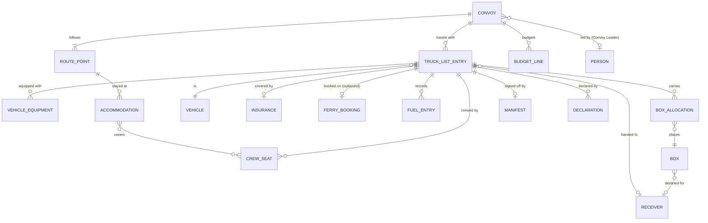

# Convoy operations

The business rules for planning and running a convoy: its vehicles, crew, accommodation, fuel, the load sign-off, the
Convoy Leader, and when a convoy is ready to leave. Why each rule exists is in [Decisions](decisions.md); the rules
link to it.

See also: [Sequence diagrams](../sequences/README.md), [Process diagrams](../process/README.md), [Boxes and donations](boxes-and-donations.md), [Customs declarations](customs-declarations.md),
[Key concepts](key-concepts.md).

## Purpose

A Dispatcher needs one place that answers: *is this convoy ready to leave, and what is still outstanding?* The facts
that answer it have different owners and different granularities, so each has a home, and
[readiness](#readiness) is computed from all of them.

## How the concepts fit together

Readiness is not an entity. It is computed from the rest, so it does not appear in the diagram.

## Creating a convoy

*Flows: [04 Convoy planning](../sequences/04-convoy-planning.puml) ([process](../process/04-convoy-planning.puml)).*

Alongside the route, dates and truck list, creating a convoy includes two steps:

1. **Allocate a budget** ([O12](decisions.md#o12)). See [Budget and costs](#budget-and-costs).
2. **Add vehicle equipment to the vehicles** ([O13](decisions.md#o13)). See [Vehicle equipment](#vehicle-equipment).

## Convoy

A convoy owns what is shared by every vehicle: the route, the dates, the [Convoy Leader](#the-convoy-leader) and the
budget. A convoy is the thing a Dispatcher plans.

### Route points

*Flows: [04 Convoy planning](../sequences/04-convoy-planning.puml) ([process](../process/04-convoy-planning.puml)), [08 On the road](../sequences/08-on-the-road.puml) ([process](../process/08-on-the-road.puml)).*

A route is an ordered list of route points. The Dispatcher may flag a route point as:

- an **overnight stop**, where accommodation is needed ([P15](decisions.md#p15)); or
- a **border crossing** for a named authority, which the Convoy Leader marks when it is crossed
  ([X2](decisions.md#x2)).

**The service never calculates routes or times.** A stop is an overnight stop only because the Dispatcher says so.

## Truck-list entry

A truck-list entry is a vehicle's place on a convoy, and the anchor for everything specific to that vehicle:

| Held on the entry | Rule |
|---|---|
| **Crew** | See [Crew](#crew). |
| **Insurance** | Per vehicle per convoy, covering the drivers named on it. See [Insurance](#insurance). |
| **Ferry booking** | One per vehicle, **outbound only**, because vehicles are donated and do not return. Records the reference number and ticket details ([P1](decisions.md#p1)). |
| **Fuel entries** | Recorded on the road by the Convoy Leader. |
| **Box allocations** | The boxes the vehicle carries. |
| **A handover Receiver** | May differ from the Receivers of the boxes it carries ([P5](decisions.md#p5)). |
| **Manifest** | The load sign-off. See [Manifest](#manifest-the-load-sign-off). |
| **Declarations** | See [Customs declarations](customs-declarations.md). |
| **Delivery status** | Recorded per vehicle and per box ([P5](decisions.md#p5)). |

## Crew

*Flows: [04 Convoy planning](../sequences/04-convoy-planning.puml) ([process](../process/04-convoy-planning.puml)).*

- A crew seat is **one person, on one vehicle, on one convoy** ([P12](decisions.md#p12)). There are no journey legs.
- A person cannot sit in two vehicles on the same convoy.
- Driving rights are not recorded in the system. The Dispatcher verifies them before assigning a driver
  ([P10](decisions.md#p10)).
- Removing a crew member does not affect the vehicle's insurance. **Adding a driver** needs the insurance updated.
  See [Insurance](#insurance).

## Insurance

*Flows: [04 Convoy planning](../sequences/04-convoy-planning.puml) ([process](../process/04-convoy-planning.puml)), [07 Departure](../sequences/07-departure.puml) ([process](../process/07-departure.puml)).*

Insurance is for **the vehicle to travel on the road**. Cargo is not insured ([O5](decisions.md#o5)).

- It is recorded per vehicle per convoy: insurer, policy number, cover start and end, optional cost, and who recorded
  it.
- **Removing a crew member does not void it.** The remaining drivers stay covered ([O7](decisions.md#o7)).
- **Adding a driver needs the insurance updated** with the insurer, which the Dispatcher records. There is **no
  cut-off** after which a change needs extra approval.
- A vehicle cannot depart unless every driver on it is covered.
- Taking a vehicle off the convoy, or cancelling the convoy, removes its insurance.

## Accommodation

*Flows: [04 Convoy planning](../sequences/04-convoy-planning.puml) ([process](../process/04-convoy-planning.puml)), [07 Departure](../sequences/07-departure.puml) ([process](../process/07-departure.puml)).*

- Accommodation is booked **per crew member** and linked to a **route point**
  ([P2](decisions.md#p2)). A booking may cover several people who choose to share.
- **Every crew member must be covered at every overnight stop** ([P8](decisions.md#p8)). Drivers never sleep in
  vehicles or at home.
- **A crew member who arranges their own accommodation**, for example by staying with family, is **flagged as such**,
  which satisfies the requirement for that person. The flag is set **per crew member, per overnight stop**
  ([O4](decisions.md#o4), [O30](decisions.md#o30)).
- **If a crew member leaves, their booking stays.** The Dispatcher may try to cancel or refund it, and the booking
  raises a warning and a task until they do. **If the crew member is replaced, the booking can be migrated** to the
  new driver ([P13](decisions.md#p13), [P16](decisions.md#p16)).

## Budget and costs

*Flows: [04 Convoy planning](../sequences/04-convoy-planning.puml) ([process](../process/04-convoy-planning.puml)), [09 Delivery, acceptance and closing](../sequences/09-delivery-acceptance-closing.puml) ([process](../process/09-delivery-acceptance-closing.puml)).*

A convoy has a **budget with a line for each cost type**: fuel, ferry, hotel, insurance and others. **Actual costs**
are recorded against each line, and compared with it ([O12](decisions.md#o12), [P3](decisions.md#p3)).

- **Allocating the budget is a step in creating a convoy.** An approval flow may follow later.
- **A budget is not required to depart.** An unset budget is an advisory warning ([O37](decisions.md#o37)).
- **Fuel:** the Convoy Leader **records fuel spent** on the road, against a vehicle, from the
  [checklist page](#the-checklist-page). Entries stay under the name of the leader who made them
  ([P14](decisions.md#p14)).
- **Ferry, hotel and insurance:** the cost is held with the booking or policy it belongs to.
- Reimbursing volunteers is not managed by the system ([O10](decisions.md#o10)).

## Vehicle equipment

Equipment the charity buys for a vehicle, such as warning triangles, is **accounted for separately** from donations
([O13](decisions.md#o13)).

- It is added to the vehicles in **a step of creating a convoy.**
- It has **no donor**, and it is **not part of the value delivered**.

## Delivery, arrival and closing

*Flows: [09 Delivery, acceptance and closing](../sequences/09-delivery-acceptance-closing.puml) ([process](../process/09-delivery-acceptance-closing.puml)).*

- **A vehicle or box is delivered when the Convoy Leader or the Dispatcher marks it arrived** ([O8](decisions.md#o8)).
- It is then **accepted** when Ukrainian customs accept it ([O9](decisions.md#o9)). Acceptance is recorded **once per
  Ukrainian goods list**, by the Convoy Leader or the Dispatcher, and every box on the list becomes accepted
  ([O24](decisions.md#o24)). See [Boxes and donations](boxes-and-donations.md#delivery-refusal-and-loss).
- **A convoy is closed once it has arrived.** Closing generates a **report of expected versus actual costs, and of the
  boxes delivered or not** ([O10](decisions.md#o10)).
- **The Dispatcher closes a convoy, and closing does not lock it.** Later corrections are allowed, and the report can be
  regenerated ([O25](decisions.md#o25)).

## Progress, records and notifications

*Flows: [08 On the road](../sequences/08-on-the-road.puml) ([process](../process/08-on-the-road.puml)), [01 Login and attribution](../sequences/01-login-and-attribution.puml) ([process](../process/01-login-and-attribution.puml)).*

- **There is no live tracking and no GPS**, because of connectivity and security concerns. The Convoy Leader marks
  arrival at each route point and each accommodation, and HQ sees progress from those marks
  ([O20](decisions.md#o20)).
- **A Dispatcher may record a mark or a border crossing on the Convoy Leader's behalf,** from a radio or phone
  report, and is named as the person who recorded it. Only the time of entry is recorded ([O27](decisions.md#o27)).
- **If the page is unavailable, call HQ and use printed documents** ([O18](decisions.md#o18)).
- **Every entity records who last changed it, and when** ([O19](decisions.md#o19)).
- **Notifications are shown on screen.** Email may be built later ([O21](decisions.md#o21)).

## Manifest: the load sign-off

*Flows: [05 Load sign-off and declarations](../sequences/05-load-signoff-and-declarations.puml) ([process](../process/05-load-signoff-and-declarations.puml)), [06 Load change and re-declare](../sequences/06-load-change-and-redeclare.puml) ([process](../process/06-load-change-and-redeclare.puml)).*

A manifest is **the load sign-off for one truck-list entry, and the document pack generated from the load and its
declarations** ([P6](decisions.md#p6)).

- Its lifecycle is short: proposed, then approved or rejected.
- It answers one question: *has an Administrator vouched for this vehicle's load?*
- It does **not** hold customs paperwork, the ferry booking or delivery state.
- **Every load change after sign-off needs Administrator re-approval** ([X3](decisions.md#x3)). See
  [Customs declarations](customs-declarations.md#the-manifest-sign-off).

## The Convoy Leader

*Flows: [04 Convoy planning](../sequences/04-convoy-planning.puml) ([process](../process/04-convoy-planning.puml)), [08 On the road](../sequences/08-on-the-road.puml) ([process](../process/08-on-the-road.puml)).*

A convoy has **exactly one Convoy Leader**: a Driver on the convoy who is the responsible party and the contact
point to HQ ([D8](decisions.md#d8), [P7](decisions.md#p7)). "Lead driver" means the same thing.

| Rule | Source |
|---|---|
| The **Dispatcher nominates** the Convoy Leader when creating or managing the convoy. Any Driver on the convoy may be nominated, and the history of who held the role is kept. | [D17](decisions.md#d17) |
| **Only a Dispatcher or an Administrator may reassign** the Convoy Leader. | [P14](decisions.md#p14) |
| The Convoy Leader may **move boxes** and **confirm delivery**. | [D26](decisions.md#d26) |
| The Convoy Leader **changes a box's status** when customs refuse it at a border: **seized**, or **returned to a hub**. | [O2](decisions.md#o2) |
| The Convoy Leader **marks each border crossed**, **marks arrival at each route point and accommodation**, and **enters fuel**, from the checklist page. | [X2](decisions.md#x2), [O20](decisions.md#o20) |
| **Only the Convoy Leader is given route and destination details.** Other drivers are not, and the Convoy Leader communicates with every member of the convoy by radio. | [O1](decisions.md#o1) |

### The checklist page

The checklist page lists the route's points in order. The Convoy Leader marks each one reached, marks borders crossed,
and enters fuel on it.

- It is a **web page used on a phone over the internet.** No app is installed and **nothing is stored on the
  device** ([X10](decisions.md#x10)).
- It requires sign-in and is sent with no-store cache headers. It keeps no address in local or session storage, a
  service worker or an offline cache.

### Access to addresses

*Flows: [10 Leader address access](../sequences/10-leader-address-access.puml) ([process](../process/10-leader-address-access.puml)).*

The Convoy Leader sees the addresses they need to drive to, **including the final destination**, so the convoy can
arrive together ([X7](decisions.md#x7)). This is the only access to an address outside the Ground Officer role.

| Rule | Source |
|---|---|
| They see **the route, and the addresses of all Receivers on their own convoy**: every box's and every vehicle's Receiver. | [X9](decisions.md#x9), [O26](decisions.md#o26) |
| Addresses **become visible 14 days before the planned departure**, and stop being visible on reassignment or on arrival. The figure is configuration. | [X11](decisions.md#x11) |
| **Before that window opens** they see only each route point's header (its name and kind, such as "UK port" or "overnight stop"), not its details. | [X13](decisions.md#x13) |

**Safeguards** ([X12](decisions.md#x12)):

- Access is **scoped to their own convoy**, and only while they lead it. A driver holds the permission on one convoy
  only.
- It is a **new, narrower permission**, not an extension of `receivers:detail`, so the Ground Officer policy is
  unchanged and a reviewer sees the new path.
- **Every read is audited**, in the same transaction as the read, and is made through the existing sensitive path, so
  the database `DENY` stays in force for the application.
- **Nothing is printed or logged.** The address appears on the checklist page only. It stays off the manifest, the
  label, the filing sheet, telemetry and every queue message.

## Readiness

Readiness is **computed from the facts and never stored.** Each requirement has a scope (the convoy, or one vehicle),
a state (*done, to do, blocked* or *warning*), an owner role, a severity (*blocking* or *advisory*), and a link to
where it is resolved. A withdrawn vehicle is skipped.

### Departure

*Flows: [07 Departure](../sequences/07-departure.puml) ([process](../process/07-departure.puml)).*

**A convoy departs by one action on the convoy, taken by the Dispatcher.** It is refused unless every blocking
requirement below holds for the convoy and for each vehicle still travelling, and the refusal lists what is
outstanding ([O36](decisions.md#o36)).

### Blocking requirements

These stop a convoy departing ([P4](decisions.md#p4)).

| Scope | Requirement | Source |
|---|---|---|
| Convoy | A Convoy Leader is assigned. | [P4](decisions.md#p4) |
| Convoy | Every crew member has accommodation at every overnight stop, or is flagged as arranging their own. | [P8](decisions.md#p8), [O4](decisions.md#o4) |
| Vehicle | At least **one** driver is crewed. | [P9](decisions.md#p9) |
| Vehicle | Insurance is recorded, in cover, and covers **every driver** on the vehicle. | [P4](decisions.md#p4), [O7](decisions.md#o7) |
| Vehicle | A ferry booking exists. | [P1](decisions.md#p1) |
| Vehicle | A handover Receiver is set and **registered**. | [P11](decisions.md#p11) |
| Vehicle | Every allocated box is validated and has a **registered** Receiver. | [D35](decisions.md#d35) |
| Vehicle | Declarations are **current** for every instrument: none stale, refused or missing, and no open re-declare task. | [D13](decisions.md#d13) |

Two earlier rules carry over unchanged: the convoy has a route, and a vehicle must have passed inspection to join a
truck list.

**Blocking requirements are not overridden.** They are business rules, and a vehicle is never driven without
insurance, for example. Where a real need exists the rule itself changes, as it did for self-arranged accommodation
([O3](decisions.md#o3)).

### Advisory warnings

None of these block departure ([P17](decisions.md#p17)).

| Warning | Source |
|---|---|
| Fewer than two drivers on a vehicle | [P9](decisions.md#p9) |
| Sensitive cargo not yet acknowledged by the Dispatcher | [D7](decisions.md#d7) |
| Items expired, or short of the required shelf life | [D1](decisions.md#d1), [D25](decisions.md#d25) |
| A declaration or goods-list deadline within a week | [D34](decisions.md#d34) |
| Cargo over a vehicle's weight limit or cargo volume | [D10](decisions.md#d10) |
| A booking left behind by a departed crew member | [P16](decisions.md#p16) |
| Insurance does not cover the whole journey | [P17](decisions.md#p17) |
| A hotel booking's dates do not match the route's estimated times | [P17](decisions.md#p17) |
| A ferry sailing time conflicts with the route timing, or ticket details are missing | [P17](decisions.md#p17) |
| An item has no category, value or donor | [P17](decisions.md#p17) |
| A Receiver's registration expires before the expected delivery date | [P17](decisions.md#p17) |
| No budget is set for the convoy, or an actual cost is ahead of its budget line | [P17](decisions.md#p17), [O12](decisions.md#o12), [O37](decisions.md#o37) |
