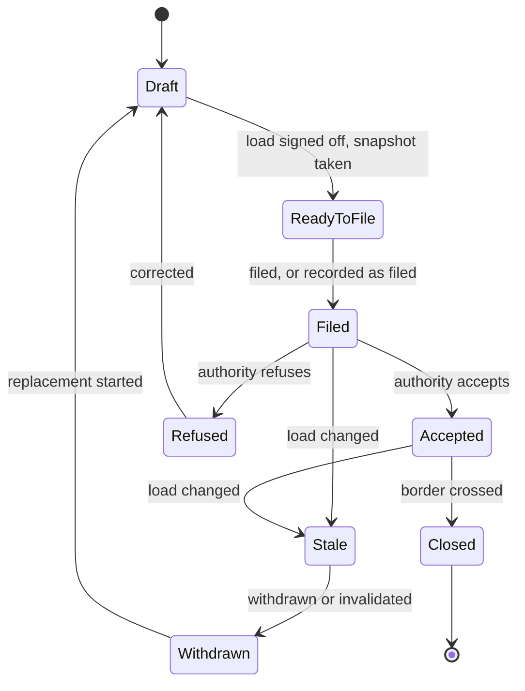

# Customs declarations

The business rules for the declarations made to customs authorities about a vehicle's load: what they are, how they
move through states, when they go stale, and how each is corrected. Why each rule exists is in
[Decisions](decisions.md); the rules link to it.

See also: [Sequence diagrams](../sequences/README.md), [Process diagrams](../process/README.md), [Convoy operations](convoy-operations.md), [Boxes and donations](boxes-and-donations.md),
[Key concepts](key-concepts.md), [Ukrainian customs research](ua-customs-requirements.md).

## What a declaration is

*Flows: [05 Load sign-off and declarations](../sequences/05-load-signoff-and-declarations.puml) ([process](../process/05-load-signoff-and-declarations.puml)).*

A declaration is a statement made to a customs authority about a vehicle's load, before that vehicle crosses the
authority's border. **Every declaration is per vehicle**, because that is what is declared at the border
([X6](decisions.md#x6)).

| Instrument | Authority | Filed by | How it is corrected |
|---|---|---|---|
| **GMR** | UK (HMRC) | Dispatcher | The GVMS API has update and delete operations, so amendment can be automatic once built. |
| **ENS** (ICS2) | EU | The **Dispatcher**, by hand in the EU portal. A Ground Officer may answer questions about destinations ([X1](decisions.md#x1)). | Several fields cannot be amended, so the normal correction is **invalidate and refile**, producing a new MRN. |
| **ELO** (envelope) | France | Created from the ENS MRN | Modifiable only while open and unpaired, and **a declaration cannot be added or removed** after creation. A changed ENS means a new envelope. |
| **Goods list** | Ukraine | **The Receiver**, outside the system. The Dispatcher records the reference ([D12](decisions.md#d12), [D20](decisions.md#d20)). | No amendment route is known. The goods are held and **a new list is filed** ([D24](decisions.md#d24), [D31](decisions.md#d31)). |

- **Order:** the ELO cannot be created without the ENS MRN, so it is **ENS, then ELO**. The GMR is independent.
- **Ukrainian granularity:** the goods list is **one per Receiver, per vehicle, per convoy**. A vehicle carrying boxes
  for several Receivers therefore has several lists. Whether Ukrainian customs accept that at the border is not known
  ([Q-multi-receiver-border](decisions.md#q-multi-receiver-border)), and **we do not assume it will.**

- **Codes:** the commodity code on each declaration comes from the item's category, through the mapping from
  categories to each authority's codes ([O16](decisions.md#o16)).

## Submission mode

*Flows: [05 Load sign-off and declarations](../sequences/05-load-signoff-and-declarations.puml) ([process](../process/05-load-signoff-and-declarations.puml)).*

**Filing is manual by default** ([X5](decisions.md#x5)). Each authority has a **submission mode**, *manual* or
*automatic*, set by configuration. The system must not assume an authority's API is operating.

In manual mode, **"filed" means a Dispatcher records the authority's reference.** UK and French declarations are
completed by hand in their portals ([X3](decisions.md#x3), [D4](decisions.md#d4)).

## Lifecycle

One lifecycle serves all four instruments.

| State | Meaning |
|---|---|
| **Draft** | Content is being prepared. Nothing has been sent. |
| **Ready to file** | Content is complete and a **snapshot of the load** is stored. |
| **Filed** | Submitted, or recorded as submitted. Awaiting the authority's answer. |
| **Accepted** | The authority has issued a reference. **The only state that counts as current.** |
| **Refused** | The authority refused it. Only a bounded reason code is kept, never the authority's free text, because it may quote the declaration. |
| **Stale** | The load no longer matches the snapshot. **Derived, never set by hand.** |
| **Withdrawn** | Cancelled, deleted or invalidated so a replacement can be filed. The old record is kept. |
| **Closed** | The border it covers has been crossed. It is frozen. |

For the **ENS**, filed and accepted collapse: an MRN is issued only on acceptance, and the system only records it.

## Staleness

*Flows: [06 Load change and re-declare](../sequences/06-load-change-and-redeclare.puml) ([process](../process/06-load-change-and-redeclare.puml)).*

When a declaration becomes *ready to file* it stores a **snapshot** of what it was written from: the boxes (by
identity and version), their items, weights, values, categories and Receivers, and the vehicle. It is **stale**
whenever the current load differs from the snapshot. No one flags it, so it cannot be forgotten.

| Makes a declaration stale | Does not |
|---|---|
| A box is added, removed, replaced ([D3](decisions.md#d3)) or moved to another vehicle ([D13](decisions.md#d13), [D27](decisions.md#d27)), or leaves the load after being refused or found undeliverable ([O2](decisions.md#o2), [O5](decisions.md#o5)) | Moving a box between bays |
| A box's weight, items, value, category or Receiver changes | Reissuing a QR label |
| A vehicle is swapped, or withdrawn after a breakdown | Recording delivery progress |
| A Receiver stops being registered | Changing crew or accommodation |

### What staleness does

1. The declaration shows **Stale**, and an immediate **re-declare task** appears for the Dispatcher
   ([D13](decisions.md#d13)).
2. The vehicle fails the blocking requirement "declarations current", so **the convoy cannot depart**
   ([P4](decisions.md#p4)).
3. The task offers the resolution that fits the instrument:

| Instrument | Resolution |
|---|---|
| GMR | Update it, or delete and recreate. Manual for now, automatic when the GVMS client is wired in. |
| ENS | Invalidate and refile. A new MRN is recorded and the **old MRN is kept as history**. |
| ELO | A new envelope against the new MRN. |
| Goods list | The Dispatcher prepares a new list, the Receiver files it, and the goods wait at a registered hub near the border until it is accepted ([D24](decisions.md#d24), [D31](decisions.md#d31), [D32](decisions.md#d32)). |

## The manifest sign-off

*Flows: [05 Load sign-off and declarations](../sequences/05-load-signoff-and-declarations.puml) ([process](../process/05-load-signoff-and-declarations.puml)), [06 Load change and re-declare](../sequences/06-load-change-and-redeclare.puml) ([process](../process/06-load-change-and-redeclare.puml)).*

The [manifest](convoy-operations.md#manifest-the-load-sign-off) is the Administrator's sign-off of a vehicle's load.

- **The freeze applies to the declared snapshot, not to the load.** The load may change, but doing so makes the
  sign-off and the declarations stale. Nothing silently carries on describing a different load.
- **Every load change after sign-off needs Administrator re-approval** ([X3](decisions.md#x3)).
- **Declarations are prepared after sign-off.** Filing is an explicit act, not a side effect of approval.

## Closing at the border

*Flows: [08 On the road](../sequences/08-on-the-road.puml) ([process](../process/08-on-the-road.puml)).*

Each authority has its own crossing: leaving the UK, entering France, entering Ukraine. A declaration **closes**
when the crossing it covers has been passed. **The Convoy Leader marks the crossing**, per vehicle, from the
[checklist page](convoy-operations.md#the-checklist-page) ([X2](decisions.md#x2)).

A crossing is an **event**, not a stretch of the journey. Once a declaration is closed it is frozen, and a change to
the load can no longer make it stale, because the crossing has happened.

## Roles

| Act | Who |
|---|---|
| Prepare and file or record a GMR, ENS or ELO | Dispatcher |
| Prepare a Ukrainian goods list, and record its filing reference | Dispatcher |
| File a Ukrainian goods list | The Receiver, outside the system |
| Re-approve a changed load | Administrator |
| Mark a border crossed | Convoy Leader |
| Answer the Dispatcher's questions about destinations while an ENS is completed, and **enter the consignee address** in the EU portal ([O32](decisions.md#o32)) | Ground Officer, outside the system |
| Record a Ukrainian goods list as **accepted** ([O24](decisions.md#o24)) | Convoy Leader or Dispatcher |
| Mark a border crossed on the Convoy Leader's behalf ([O27](decisions.md#o27)) | Dispatcher, named |

The ENS filing sheet **withholds the Receiver's address**, and the system never shows it to a Dispatcher
([X1](decisions.md#x1), [ADR 0003](../adr/0003-ens-declaration-recorded-not-submitted.md)).
