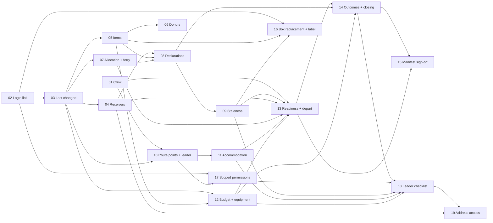

# Implementation plans

A series of plans that implement [ADRs 0004 to 0017](../adr/README.md) and the feature decisions in
[Decisions](../domain/decisions.md) that have no ADR of their own. Each plan is one **branch** and one **PR**. An agent
executes a plan, opens the PR and **stops**. The developer reviews and merges, and only then does the next plan start.

The business rules each plan implements are in [`docs/domain/`](../domain/README.md). The flows are drawn twice:
as calls between people and systems in [`docs/sequences/`](../sequences/README.md), and as role-by-role processes in
[`docs/process/`](../process/README.md), starting with the
[end-to-end overview](../process/00-end-to-end-overview.puml). Lifecycles are in
[`docs/states/`](../states/README.md), permissions in [`docs/use-cases/`](../use-cases/README.md), the target
[domain model](../model/domain-model.puml) is one class diagram, and the time rules are on a worked
[convoy timeline](../timeline/convoy-timeline.puml). When a plan changes a drawn flow, it updates both
diagrams. When a plan and a domain document
disagree, the domain document wins: raise it in the PR rather than building around it.

## Index

| # | Plan | Branch | Covers | Depends on | Gate | Status |
|---|---|---|---|---|---|---|
| 01 | [Crew without legs](01-crew-without-legs.md) | `feat/crew-without-legs` | [ADR 0007](../adr/0007-journey-legs-are-removed-from-the-crew-model.md), [O7](../domain/decisions.md#o7) | – | – | Done |
| 02 | [Link a login to a person](02-login-person-link.md) | `feat/login-person-link` | [O34](../domain/decisions.md#o34), [O35](../domain/decisions.md#o35) | – | `/security-review` before PR | Done |
| 03 | [Who last changed it](03-last-changed-audit.md) | `feat/last-changed-audit` | [ADR 0017](../adr/0017-every-entity-records-its-last-change.md) | 02 | – | Done |
| 04 | [Receiver registration](04-receiver-registration.md) | `feat/receiver-registration` | [ADR 0012](../adr/0012-receiver-registration-gates-convoys-and-boxes.md), [P11](../domain/decisions.md#p11) | 03 | – | Done |
| 05 | [Item classification and value](05-item-classification-value.md) | `feat/item-classification-value` | [ADR 0014](../adr/0014-items-are-classified-by-category-and-valued-in-gbp.md) | 03 | – | Done |
| 06 | [Donors and donations](06-donors-donations.md) | `feat/donors-donations` | [ADR 0013](../adr/0013-donors-are-a-split-identity.md) | 05 | – | Done |
| 07 | [Box allocation and ferry booking](07-box-allocation-ferry.md) | `feat/box-allocation-ferry` | [ADR 0004](../adr/0004-the-manifest-is-the-load-sign-off.md) (cargo), [P1](../domain/decisions.md#p1) | 03 | – | Done |
| 08 | [Declarations and filing mode](08-declarations-filing.md) | `feat/declarations-filing` | [ADR 0005](../adr/0005-declarations-are-per-vehicle-with-derived-staleness.md) (entity), [ADR 0006](../adr/0006-filing-is-manual-by-default.md) | 04, 05, 07 | – | Done |
| 09 | [Declaration staleness](09-declaration-staleness.md) | `feat/declaration-staleness` | [ADR 0005](../adr/0005-declarations-are-per-vehicle-with-derived-staleness.md) (snapshot) | 08 | – | In review |
| 10 | [Route points and the Convoy Leader](10-route-points-convoy-leader.md) | `feat/route-points-convoy-leader` | [P15](../domain/decisions.md#p15), [D17](../domain/decisions.md#d17), [P14](../domain/decisions.md#p14) | 01, 03 | – | In review |
| 11 | [Accommodation](11-accommodation.md) | `feat/accommodation` | [P2](../domain/decisions.md#p2), [P8](../domain/decisions.md#p8), [P13](../domain/decisions.md#p13), [P16](../domain/decisions.md#p16), [O4](../domain/decisions.md#o4), [O30](../domain/decisions.md#o30) | 10 | – | In review |
| 12 | [Budget, costs and equipment](12-budget-equipment.md) | `feat/budget-equipment` | [O12](../domain/decisions.md#o12), [O13](../domain/decisions.md#o13), [O37](../domain/decisions.md#o37) | 03, 05 | – | In review |
| 13 | [Readiness and departure](13-readiness-departure.md) | `feat/readiness-departure` | [ADR 0008](../adr/0008-readiness-is-computed-and-blocking-rules-are-not-overridden.md), [O36](../domain/decisions.md#o36) | 01, 04, 07, 09, 11, 12 | – | Not started |
| 14 | [Outcomes and closing](14-outcomes-closing.md) | `feat/outcomes-closing` | [ADR 0015](../adr/0015-box-and-vehicle-outcomes-and-convoy-closing.md) | 08, 12, 13 | – | Not started |
| 15 | [Manifest sign-off lifecycle](15-manifest-signoff-lifecycle.md) | `feat/manifest-signoff-lifecycle` | [ADR 0004](../adr/0004-the-manifest-is-the-load-sign-off.md) (lifecycle), [X3](../domain/decisions.md#x3) | 13, 14 | – | Not started |
| 16 | [Box replacement and bilingual label](16-box-replacement-label.md) | `feat/box-replacement-label` | [ADR 0011](../adr/0011-attested-boxes-are-replaced-not-edited.md) | 02, 05, 09 | **Spike + label review** | In review |
| 17 | [Scoped permissions](17-scoped-permissions.md) | `feat/scoped-permissions` | [ADR 0010](../adr/0010-resource-scoped-permissions.md) | 02, 10 | **Mechanism sign-off** | Not started |
| 18 | [Convoy Leader checklist and progress](18-leader-checklist-progress.md) | `feat/leader-checklist-progress` | [ADR 0016](../adr/0016-progress-is-reported-not-tracked.md), [X2](../domain/decisions.md#x2) | 09, 11, 12, 14, 17 | – | Not started |
| 19 | [Convoy Leader address access](19-leader-address-access.md) | `feat/leader-address-access` | [ADR 0009](../adr/0009-convoy-leader-reads-destination-addresses.md) | 04, 18 | **Security review** | Not started |

Update the **Status** column in the same PR as the plan: *In progress* when the branch is opened, *In review* when the
PR is opened, *Done* is set by the developer on merge.

## Dependencies



**Critical path (remaining):** 10 → 11 → 13 → 14 → 18 → 19. Plan 09 is not on it, but 13 needs it. Plans 12, 16 and 17
have slack.

**Every merged plan leaves the system working.** While plans 08 to 14 are in flight, some legacy manifest behaviour
sits alongside the new facts. Each plan has a **Retires and transitional** section that says what it removes and
what it deliberately leaves for a later plan.

## Running plans in parallel

Plans 01 to 08 have merged. Each remaining plan can start the moment its dependencies have merged, so the remaining work
runs in **waves**. Everything in a wave is independent of the rest of the wave. Each plan runs in its own worktree
and stack ([`docs/parallel-agents.md`](../parallel-agents.md), skill `agent-worktree`).

| Wave | Start when merged | Plans (one agent each) | Stacks |
|---|---|---|---|
| 1 | now | **09** Staleness, **10** Route points + leader, **12** Budget + equipment | 3 |
| 1, docs only | now | Increment 0 of **16** (spike, label review), **17** (mechanism into ADR 0010), **19** (security review): draft PRs, no code | 0 |
| 2 | 10 → **11** and **17** implementation; 09 → **16** implementation | 11, 16, 17 | 3 |
| 3 | 09, 11, 12 → **13** | 13 | 1 |
| 4 | 13 → **14** | 14 | 1 |
| 5 | 14 (and 17) → **15**, **18** | 15, 18 | 2 |
| 6 | 18 → **19** | 19 | 1 |

A wave is a ceiling, not a barrier: a plan starts as soon as **its own** dependencies merge, not when the whole previous
wave has. For example 16 starts when 09 merges even if 10 and 12 are still in review.

**The owner gates cost nothing now.** Increment 0 of 16, 17 and 19 is a document, not code. Starting those in wave 1
lets the owner review the spike, the mechanism and the security review while code plans run, so the gates leave the
critical path. Each resumes on the same branch once signed off.

### Limits to plan around

- **At most three full stacks at once.** An agent stack is capped at about 3.5 GB, and a 16 GB Docker VM fits the main
  stack plus two more. `agent.ps1 up` warns when the VM cannot take another. Docs-only increments need no stack.
- **Shared files are where parallel plans collide**, not the code:

| Shared file | Touched by | Rule |
|---|---|---|
| `CLAUDE.md`, `README.md`, `docs/domain/key-concepts.md`, `docs/gotchas-and-open-questions.md` | every plan | Add your own paragraph or row. Never reflow or reorder existing text. Resolve a conflict by keeping both sides. |
| This index (`Status` column) | every plan | Edit only your own row. |
| `docs/domain/decisions.md` amendments table | every plan | Delete only the rows your plan satisfies. |
| `web/src/auth/policyMatrix.ts`, `AuthenticationExtensions.cs` | 10, 17 | 10 adds policies, 17 changes how they are evaluated. 17 implementation waits for 10, as its dependency says. |
| `ManifestEndpoints.cs`, `ManifestTransitionUseCases.cs` | 13, 15 | Sequenced by dependency. |
| `ConvoyRepository`, `InMemoryConvoyRepository`, `FreedomApi` helper | 10, 12 (same wave), 14, 15 | Whoever merges second rebases and re-runs the component tests. |
| `database/` tables | most | Each plan adds its own table files. Editing an existing table file is the conflict risk: rebase, then `agent.ps1 db`. |

- **Merge in dependency order.** The developer merges one PR at a time. Every other open PR then rebases on `main`
  (`git fetch && git rebase origin/main`), re-runs the build plus the unit and component tests, and pushes with
  `--force-with-lease` before review. A PR not rebased since the last merge is not ready for review.
- **Never stack branches.** An agent whose dependency has not merged waits. A plan in the same wave is *not* a
  dependency: ignore it, and expect to rebase.

## Owner gates

Four plans stop for the owner before writing production code. The gate is the plan's **Increment 0**.

| Plan | Gate | What the agent produces, then stops |
|---|---|---|
| 16 | Translation spike **and** label data-sensitivity review | A spike report and a review document, in a **draft** PR |
| 17 | ADR 0010 mechanism sign-off | The concrete mechanism written into ADR 0010, in a **draft** PR |
| 19 | Security review of ADR 0009 | `docs/security/0009-review.md`, in a **draft** PR |

Plans 02, 17 and 19 also run the `/security-review` skill before the PR is opened. That is a check, not an owner gate.

When an owner signs off a gate, the agent continues on the **same branch**, and the draft PR becomes the plan's PR.

## Coverage

| ADR or decision | Plan |
|---|---|
| [0004](../adr/0004-the-manifest-is-the-load-sign-off.md) | 07 (cargo, ferry), 08 (approval only signs off), 15 (lifecycle) |
| [0005](../adr/0005-declarations-are-per-vehicle-with-derived-staleness.md) | 08 (entity, lifecycle), 09 (staleness), 18 (closing at a crossing) |
| [0006](../adr/0006-filing-is-manual-by-default.md) | 08 |
| [0007](../adr/0007-journey-legs-are-removed-from-the-crew-model.md) | 01 |
| [0008](../adr/0008-readiness-is-computed-and-blocking-rules-are-not-overridden.md) | 01 (insurance), 13 |
| [0009](../adr/0009-convoy-leader-reads-destination-addresses.md) | 19 |
| [0010](../adr/0010-resource-scoped-permissions.md) | 02 (login link), 17 |
| [0011](../adr/0011-attested-boxes-are-replaced-not-edited.md) | 16 |
| [0012](../adr/0012-receiver-registration-gates-convoys-and-boxes.md) | 04 |
| [0013](../adr/0013-donors-are-a-split-identity.md) | 06 |
| [0014](../adr/0014-items-are-classified-by-category-and-valued-in-gbp.md) | 05 |
| [0015](../adr/0015-box-and-vehicle-outcomes-and-convoy-closing.md) | 14, 18 (leader's own actions) |
| [0016](../adr/0016-progress-is-reported-not-tracked.md) | 18 |
| [0017](../adr/0017-every-entity-records-its-last-change.md) | 02, 03 |
| Ferry per vehicle ([P1](../domain/decisions.md#p1)) | 07 |
| Accommodation ([P2](../domain/decisions.md#p2), [P8](../domain/decisions.md#p8), [P13](../domain/decisions.md#p13), [P16](../domain/decisions.md#p16), [O4](../domain/decisions.md#o4), [O30](../domain/decisions.md#o30)) | 11 |
| Route point kinds ([P15](../domain/decisions.md#p15)), leader nomination ([D17](../domain/decisions.md#d17), [P14](../domain/decisions.md#p14)) | 10 |
| Budget, costs, equipment ([O12](../domain/decisions.md#o12), [O13](../domain/decisions.md#o13), [O37](../domain/decisions.md#o37), [P3](../domain/decisions.md#p3)) | 12 |
| Expiry and sensitive goods ([D1](../domain/decisions.md#d1), [D7](../domain/decisions.md#d7), [D16](../domain/decisions.md#d16), [D21](../domain/decisions.md#d21), [D25](../domain/decisions.md#d25)) | 05 (data and warnings), 13 (readiness warnings) |
| Capacity ([D10](../domain/decisions.md#d10), [D18](../domain/decisions.md#d18)) | 07 (warning moves with allocation), 13 |
| Value report ([D29](../domain/decisions.md#d29)) | 05 (values), 14 (closing report), 06 (donor report) |
| Notifications on screen ([O21](../domain/decisions.md#o21)) | 09 (re-declare tasks), 11 (booking tasks) |

**Not planned yet:** [Q-retention](../domain/decisions.md#q-retention) and
[Q-vehicle-equipment](../domain/decisions.md#q-vehicle-equipment) are open questions. Expected boxes
([O22](../domain/decisions.md#o22)) need only the existing box creation and are not a plan of their own.

## Agent execution protocol

Follow this for every plan. It is deliberately the same each time.

### 1. Start from an up-to-date main, in your own worktree

Never work in the main checkout: another agent may be running its stack there.

```bash
git fetch origin && git log --oneline -20 origin/main   # confirm every plan in "Depends on" has merged
scripts/agent/agent.sh new plan-NN --base origin/main --up   # PowerShell: pwsh scripts/agent/agent.ps1 new plan-NN -Base origin/main -Up
cd ../UA.Action.Freedom.worktrees/plan-NN
. ./.agent/env.sh              # PowerShell: . ./.agent/env.ps1
```

The worktree's branch is `agent/plan-NN`. Keep it, so `agent.ps1 remove` can clean up, and publish it under the
plan's branch name: `git push -u origin agent/plan-NN:<branch from the plan>`. A docs-only increment can skip `--up`.

If a dependency has not merged, **stop** and say so. Do not stack branches. Before the PR, and after each other PR
merges: `git fetch && git rebase origin/main`.

### 2. Read before writing

- `CLAUDE.md` at the repository root, and the user's global rules.
- The plan, its ADRs, and the sections of `docs/domain/` it links to.
- [`docs/gotchas-and-open-questions.md`](../gotchas-and-open-questions.md), before any long debugging session.
- Load the **`tdd`** skill. Load **`react-testing`** and **`front-end-testing`** when the plan changes `web/`.

Paths in the plans were correct on 2026-10-02. Check them before editing, because earlier plans move code.

### 3. Gate increment, if the plan has one

Produce what Increment 0 asks for, commit it, push, open a **draft** PR labelled `awaiting-owner`, and **stop**.
Resume only when the owner has signed off in the PR.

### 4. Increments: test-driven, one commit each

- **RED → GREEN → REFACTOR** for every behaviour. No production code without a failing test.
- **One commit per green increment**, on the plan's branch. The PR review is the approval for these commits. Never
  commit to `main`.
- Test order within an increment: **Unit → Component → Integration → BDD → web (Vitest + MSW) → Playwright**, as far
  as the increment reaches.
- **A fake must enforce every rule its SQL does.** Change `tests/UA.Action.Freedom.Tests.Component/InMemory*Repository`
  in the same commit as the SQL it mirrors.
- **Edit `.feature` files, never the generated `.feature.cs`.**
- **Schema:** end-state `CREATE`s only, no `ALTER`, no data moves. Write CHECKs in normalised form (`>= 0 AND <= 3`).
  Key columns that are `varchar(32)` are passed with `SqlKey.Of(...)`.
- Zero build warnings, always.

### 5. Documents change with the code

In the same branch: `README.md` (structure, endpoints, policy matrix), `CLAUDE.md`, `docs/domain/key-concepts.md`,
`docs/gotchas-and-open-questions.md`, the ADR's "Not yet implemented" note, the **Status** in this index, and
`web/src/auth/policyMatrix.ts` whenever a policy changes. The rows of
[Consequences and amendments due](../domain/decisions.md#consequences-and-amendments-due) a plan satisfies are
removed from that table.

### 6. Gates before the PR

```bash
dotnet build UA.Action.Freedom.slnx                    # zero warnings
dotnet test --solution UA.Action.Freedom.slnx

cd web
npx prettier --write <changed files>                   # npm run format:write fails in Git Bash on Windows
npm run verify                                         # typecheck, lint, format check, test, build
cd ..

scripts/agent/agent.sh down --volumes        # never raw `docker compose down -v`: it leaves stale tofu state
scripts/agent/agent.sh up --no-hot-reload    # baked images, as CI runs them; also runs tofu apply
(cd iac/local && docker compose build app manifest-worker customs-worker db-deploy \
  && docker compose up -d --wait && docker compose up db-seed)
. ./.agent/env.sh                            # so the tests below hit this worktree's stack
FREEDOM_REQUIRE_INTEGRATION=true dotnet test --project tests/UA.Action.Freedom.Tests.Integration/UA.Action.Freedom.Tests.Integration.csproj
FREEDOM_REQUIRE_INTEGRATION=true dotnet test --project tests/UA.Action.Freedom.Tests.BDD/UA.Action.Freedom.Tests.BDD.csproj
cd web && npm run e2e
```

A second publish of the database must be a no-op, as the `Database` workflow requires. When a schema change will not
apply in place, rebuild the local database from scratch.

### 7. Open the PR

```bash
git push -u origin <branch>
gh pr create --base main --title "<plan number>: <plan title>" --body-file <file>
```

The PR body has these sections:
- **Covers**: the ADRs and decisions.
- **Increments**: one line each.
- **Retired** and **Still transitional**.
- **Tests**: the layers touched and the gate output.
- **Gate evidence**, if any.
- **Risks**.

It ends with:

```
🤖 Generated with [Claude Code](https://claude.com/claude-code)
```

Each commit message ends with the `Co-Authored-By` line the session's attribution instructions give.

### 8. Stop

Do not start the next plan. The developer merges, and the next plan begins again at step 1.
